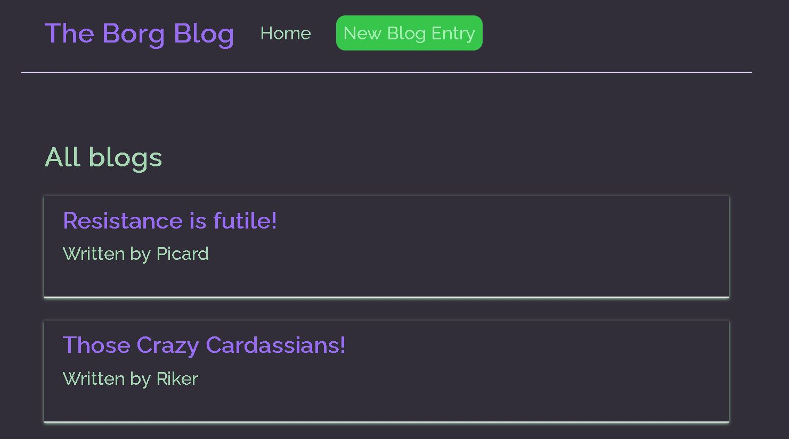

# BorgBlog

This is a pure React based blog project all about that most enterprising show, Star Trek. It uses functional components, makes use of hooks like useState, useEffect, and custom hooks like useFetch which contains business logic for fetching data from the backend (using json-server as a database) and handling any potential errors therein. A unique and borg-esque color scheme gives this project a pleasing aesthetic. This project is largely based on [this wonderful tutorial by the Net Ninja](https://www.youtube.com/watch?v=Jl4q2cccwf0&list=PL4cUxeGkcC9gZD-Tvwfod2gaISzfRiP9d&index=20&ab_channel=TheNetNinja). Below is a gander at the Borg Blog:

## Usage
npm start
*(In a separate terminal)*
npx json-server --watch data/db.json --port 8000